<picture>
  
</picture>

# Hi, I'm Shreyash Chavan 👋

### 🛡️ Cybersecurity Explorer | Software Developer

I'm currently exploring **Cybersecurity, Cloud Security, and Secure Systems** while strengthening my foundations in software development, programming, networking, and systems.

I have a background in **Computer Engineering** and experience building applications using **Java, Android, Firebase, AI APIs, databases, and automation tools**.

---

## 🛡️ Current Focus

- 🔐 Cybersecurity Fundamentals
- ☁️ Cloud Security
- 🌐 Networking & Linux
- 🧑‍💻 Ethical Hacking & Security Concepts
- 🔎 SOC & Security Operations
- 💻 C++ & Data Structures
- 🖥️ Secure Systems & Infrastructure

---

## 🧠 Cybersecurity Learning Path

```text
Cybersecurity Fundamentals
          ↓
   Linux & Networking
          ↓
 Security Fundamentals
          ↓
    Ethical Hacking
          ↓
 SOC / Security Operations
          ↓
     Cloud Security
🧰 Technical Skills
💻 Programming

C++ Java PHP

🛡️ Cybersecurity & Systems

Cybersecurity Fundamentals Linux Networking

📱 Application Development

Android XML Firebase

🗄️ Databases & Backend

MySQL Supabase

🤖 AI & Automation

Gemini API Google ML Kit n8n

🛠️ Tools

Git GitHub Android Studio VS Code

🚀 Featured Projects
🏥 MediScan AI

AI-powered healthcare application focused on medical report analysis, prescription management, and health-related information.

Tech: Java · Android · Firebase · Gemini AI · Google ML Kit

🐾 PetCare AI

AI-powered pet-care application with features for pet profiles, reminders, AI-based assistance, and veterinary support.

Tech: Java · Android · Firebase · PHP · MySQL · Gemini AI

🎯 FocusLock

Productivity-focused Android application with session tracking, app controls, notifications, Firebase integration, and productivity features.

Tech: Java · Android · Firebase

📈 TradePulse AI

Market intelligence project integrating financial data, news sources, and AI-based analysis.

Focus: Financial Data · News Intelligence · AI Integration

🎓 Education

B.Tech — AI & DS

Diploma in Computer Engineering

📚 Currently Learning
Cybersecurity
├── Security Fundamentals
├── Linux
├── Networking
├── Ethical Hacking
├── SOC & Security Operations
└── Cloud Security
🔭 What's Next

I'm gradually shifting my development focus toward Cybersecurity and Cloud Security, while continuing to strengthen my programming, networking, Linux, and systems fundamentals.

My goal is to build practical security knowledge through hands-on learning, labs, projects, and real-world security concepts.

🧪 What I'm Building
Security
   ├── Cybersecurity Labs
   ├── Security Concepts
   └── Cloud Security Learning

Development
   ├── Software Projects
   ├── AI Integrations
   └── Automation

Fundamentals
   ├── C++
   ├── DSA
   ├── Linux
   └── Networking
📊 GitHub Activity

I use GitHub to document my learning, experiments, projects, and development work.

Learning → Building → Experimenting → Securing

📫 Connect With Me
🐙 GitHub: @shreyash12156788
⚡ Profile
> Exploring Cybersecurity
> Learning Cloud Security
> Building Software
> Practicing C++ & DSA
> Exploring Linux & Networking
> Documenting the Journey
